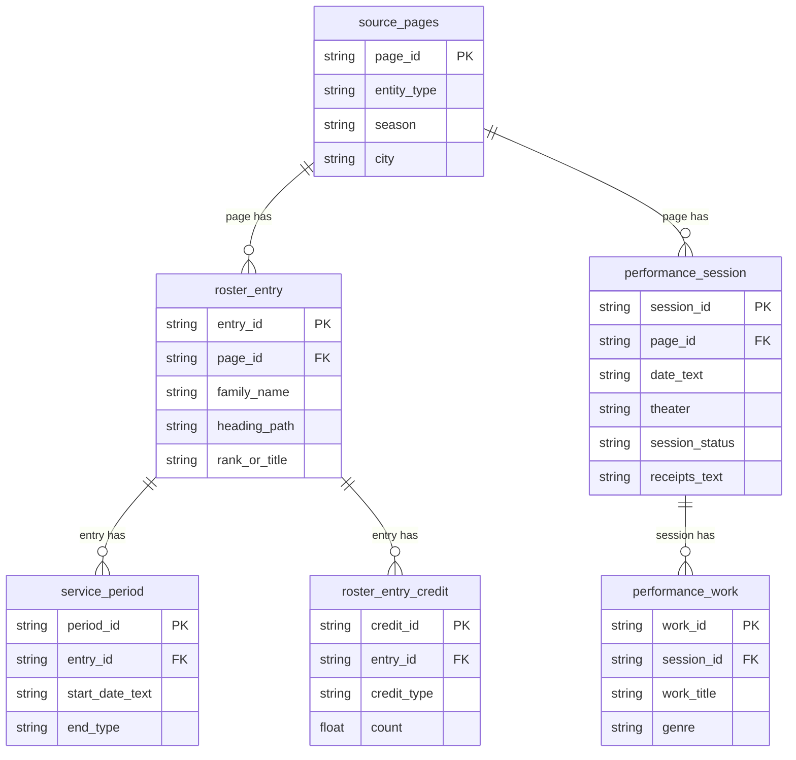
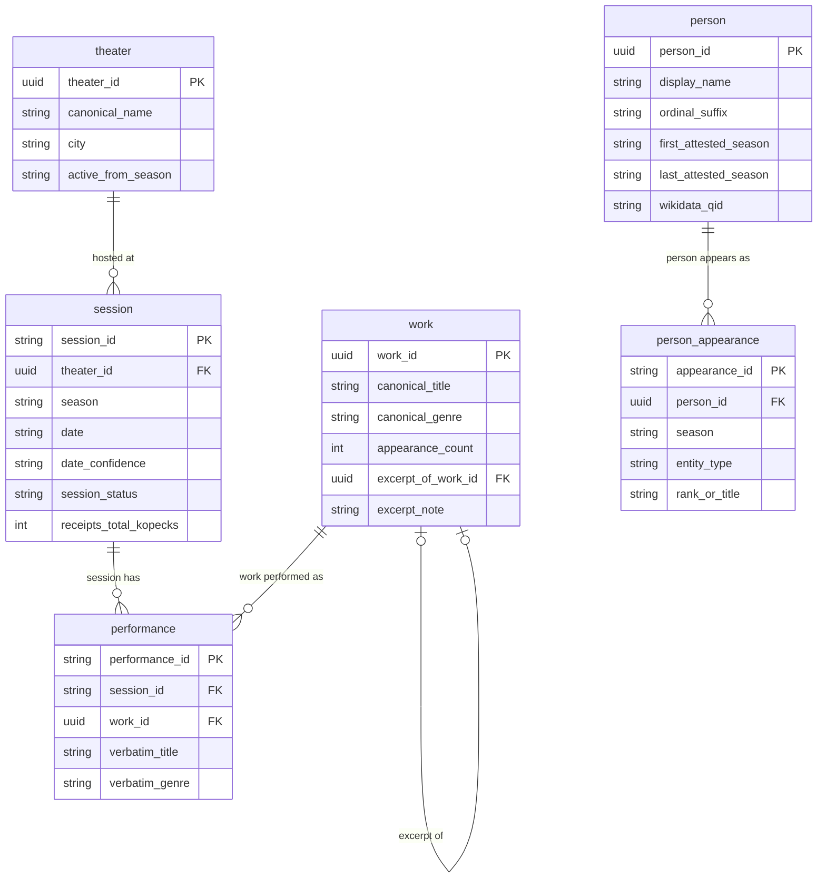

# Imperial Theater Yearbooks

How 144 scanned volumes of the **Ежегодникъ Императорскихъ театровъ**
("Yearbook of the Imperial Theatres") become a diplomatic transcription
and a linked research dataset — who worked at the Imperial Theatres, what
was performed, when, and for how much — spanning 18 consecutive seasons,
1890/91 through 1907/08.

## The source

The *Ежегодникъ Императорскихъ театровъ* ran annually from 1890 to 1908,
covering the state opera, ballet, and drama companies in St. Petersburg
and Moscow. Each year's volume is a scanned PDF containing two distinct
table families: a day-by-day performance calendar (work, venue,
box-office receipts) and staff rosters (dancers, musicians,
administrators, rank, tenure). ~1,300 pages total, set in pre-1918
orthography — ъ, ѣ, і, ѳ are original spelling, not scanning artifacts,
and are preserved rather than modernized, for the same reason a
diplomatic edition doesn't silently regularize its source.

`pdfs/` holds the source scans, one folder per entity/table type:

| Folder | What it is |
|---|---|
| `RepertoireTables` | Day-by-day performance calendar: date, theater, work performed, genre, box-office receipts |
| `Spiski_Administration` | Theatre administration staff roster |
| `Spiski_BalletArtists` | Ballet company roster (St. Petersburg and Moscow companies, separate files) |
| `Spiski_Musicians` | Orchestra roster (SP and Moscow, separate files) |
| `Spiski_ProductionTeam` | Backstage/technical staff (decorators, machinists) |
| `Spiski_TheaterSchoolStaff` | Imperial Theater School faculty and staff |
| `Spiski_Graduates`, `Spiski_ProductionStats` | Not yet sourced — see `docs/overview.md` |

144 PDFs, 1,299 scanned pages as of the last inventory (`docs/overview.md`
has the full breakdown and per-season page counts — worth reading before
assuming page count scales evenly with season, it doesn't: the Repertoire
table format changes partway through the run and roughly quadruples in
page count, documented in `docs/structural_survey.md`). See
`docs/research_questions.md` for the fuller research framing.

## Two layers, decided up front

The project commits early to a two-layer output, and the whole pipeline
exists to fill both honestly rather than conflating them:

- **A diplomatic transcription** (`docs/schema.md`) — one row per printed
  appearance, verbatim, no silent normalization, no deduplication of the
  same person across years. This is the layer that answers "what does the
  source actually say," and it's the one everything else is checked
  against.
- **A linked research dataset** (`docs/research_dataset.md`), built on
  top, where record linkage has actually been done: the same real person,
  work, or venue recognized across its many separate printed appearances.
  This is the layer that answers repertoire- and prosopography-shaped
  questions — how often was a work revived, what was a given dancer's
  full attested career — which the diplomatic layer deliberately doesn't
  attempt on its own.

Every stage below is in service of one or the other.

## Stage 1 — Rendering

Each PDF is rasterized to one image per page. Resolution turned out to
matter more than expected: an early pass at 150dpi produced recurring
character-level misreads (digit transpositions, confusable Cyrillic
letterforms); re-rendering at 300dpi eliminated nearly all of them. Worth
noting because it's the first of several points where "just run the OCR"
undersells how much the capture step itself affects downstream accuracy.

## Stage 2 — Transcription by a vision-language model

Each page image goes to a vision-language model (Qwen VL, via Alibaba's
DashScope API) — a system trained jointly on images and text — prompted
per table family to return a transcription in a fixed structured shape
(the fields in `docs/schema.md`) rather than free text. This is closer to
structured OCR with a schema constraint than to captioning: the model is
asked for `family_name`, `rank_or_title`, `tenure_note_text`, and so on,
not a paragraph description of the page.

Treat this stage the way you'd treat any single-pass transcription by a
fast, tireless, occasionally-wrong reader: useful, necessary, and not
trustworthy on its own. Its known failure modes are catalogued rather than
assumed away — sampling non-determinism on dense tables (the same page
transcribed twice can yield different completeness), and field-boundary
confusion on ambiguous visual hierarchy (deciding where a heading ends and
a person's specific role begins is a typographic judgment call the model
doesn't reproduce reliably). Both are documented in
`docs/eval/known_issues.md` rather than silently patched over.

## Stage 3 — Validation and normalization into tables

Each page's transcription is validated against the schema and flattened
into corpus-wide tables — a roster family and a repertoire family, since
their information shapes differ. Anything that fails validation is logged
to its own record rather than dropped, so a schema mismatch on one page
never silently loses data or takes down the batch.

## Stage 4 — Quality assessment, two registers

No single-pass transcription is assessed as correct by assumption. Two
complementary checks run:

- **Gold-standard evaluation.** A 12-page hand-transcribed ground truth
  set (`docs/eval/gold/`) — deliberately including the structurally
  hardest cases in the corpus, not a convenience sample of easy pages —
  gives a real accuracy score per run (currently 86.7% field-level match
  on the full corpus, with the gap concentrated in recall on the
  performance calendar, not content accuracy on what's transcribed).
- **Gold-free structural self-consistency checks**, which scale past the
  12 pages an answer key exists for: does a heading recur where the schema
  says it shouldn't, do tallied credit counts sum correctly, does a
  multi-week calendar page implausibly show zero closed dates (real
  theaters had dark nights; a page with none is a completeness flag, not
  a fact).

Findings from both are kept in a running ledger
(`docs/eval/known_issues.md`) triaged by cause — genuine model error,
inherent model non-determinism, or a gold-transcription inconsistency —
so a fix can be judged by whether it moved the aggregate score
(`docs/eval/run_history.csv`), not by whether it resolved the one example
that prompted it.

## Stage 5 — The diplomatic transcription, packaged

Once validated, everything assembles into the verbatim dataset proper —
one row per printed appearance, citable back to its source page and image
— in a single portable DuckDB file (`raw` + `analysis` schemas). It's also
shipped in parallel formats rather than one: a workbook for
pivot-table-style exploration, and a one-note-per-page reading vault
(Obsidian) for close reading and annotation (`docs/verbatim_deliverables.md`).
Same underlying rows throughout; the choice of format tracks the tool a
given collaborator already works in, not a difference in the data.

## Stage 6 — Record linkage into the research dataset

The diplomatic layer treats every printed appearance as its own row on
purpose — collapsing them prematurely would mean guessing at identity
before the transcription was even verified. Record linkage happens as a
separate, later pass (`docs/research_dataset.md`), staged by confidence
rather than run as one undifferentiated matching pass:

- **Exact, normalized matches auto-resolve.** Orthographic variants are
  folded (ѣ→е, і→и) and matched as one unit *together with* the source's
  own homonym-disambiguating ordinal ("Ивановъ 2-й") — preserved rather
  than normalized away, specifically so two different attested people
  sharing a surname are never collapsed into one just because a later
  appearance dropped the ordinal.
- **Near matches go to human adjudication, never auto-merged.** A
  Levenshtein-bounded candidate pool (spelling drift the exact-fold pass
  wouldn't catch) is exported as a reviewable pairlist with a similarity
  score and the two source contexts side by side — the actual review
  happens in an ordinary spreadsheet, not a bespoke interface, and nothing
  merges without an explicit yes. A confirmed merge is recorded
  non-destructively: both identifiers remain valid, one is marked
  superseded rather than deleted, so nothing that already cited a given
  identifier breaks.

Repertoire works and venues go through an analogous resolution: a revived
work correctly collapses to one canonical identity across seasons (that's
a feature of the record-linkage design, not a bug — a researcher studying
repertoire wants revivals recognized as the same work), while genre
metadata is deliberately *not* folded across languages, since the
Mikhailovsky's French-language troupe genuinely printed French genre
abbreviations, and collapsing those into their Russian equivalents would
erase a real distinction, not just noise.

## Where this stands

The diplomatic transcription is complete across the full corpus. Record
linkage is live for venues (essentially solved, six known venues), works
(canonicalization-based, further cleaned up per `docs/work_normalization.md`),
and people (most of the fuzzy-match pool auto-confirmed against
independent corroborating evidence — shared tenure dates, shared Wikidata
identity — per `docs/person_normalization.md`; a small remainder is still
genuinely open and awaiting human review). All three feed the
`research` schema — Person, Work, Theater, Session, Performance as
primary, directly-queryable entities — described in the Data model
section above and `docs/entity_centric_model.md`.

Nothing here is being treated as a closed, one-shot process — the
known-issues ledger and the run-history log both exist specifically so
accuracy is tracked and improved across iterations, not asserted once and
left unexamined.

## Data model

Two schemas, two different jobs. `raw` (+ `analysis`, which only adds
derived columns onto `roster_entry`/`performance_session` — no new
tables) is the diplomatic transcription: one row per printed appearance,
page-centric, nothing resolved. `research` is built on top of it
(`entities.person`/`entities.work`'s Tier 1/Tier 2 resolution, then
`pipeline/build_research_model.py`): Person, Work, Theater, Session, and
Performance as primary, directly-queryable entities with real foreign
keys baked in, no crosswalk table to traverse at query time
(`docs/entity_centric_model.md`). `raw` never changes once either is
built on top of it.

### The verbatim transcription (`raw`)

One row per printed appearance — the hub is `source_pages`, correct for
how the data was captured.



### The research dataset (`research`)

One row per resolved real person/work/venue/box-office record — the hub
is whichever entity the question is actually about. `session` and
`performance` stay distinct on purpose: 35% of sessions list more than
one work, and receipts are printed once per session, not once per work —
flattening them into one row would silently double-count receipts on
every multi-work night. `person` holds only currently-active (merged)
people; a Wikidata match, where confident, is inlined directly rather than
kept in a separate link table (`docs/person_normalization.md`,
`docs/work_normalization.md`, `docs/performance_normalization.md`).



## Repo layout

```
pdfs/               source PDF scans (see table above)
docs/
  schema.md              field-by-field data model
  structural_survey.md   how the printed table formats vary across the run
  overview.md             corpus inventory stats
  research_questions.md   what this data can answer, and modeling tradeoffs
  pipeline.md             pipeline stages, scripts, usage
  verbatim_deliverables.md   output-format comparison for the verbatim layer
  research_dataset.md       entity-resolution plan for the research layer
  entity_centric_model.md   Person/Performance/Work/Theater-centric research schema (built -- see Data model above)
  person_normalization.md   tenure- and Wikidata-based person merging
  work_normalization.md     work/genre cleanup and excerpt linking
  performance_normalization.md   calendar-validated performance dates
  eval/
    gold/                 12-page hand-transcribed ground truth + builder scripts
    known_issues.md        extraction issue ledger
    run_history.csv        accuracy per run, over time
pipeline/
  schemas/            pydantic models mirroring docs/schema.md
  prompts/            per-table-family system prompts
  render_pages.py     stage 1
  extract.py          stage 2 (single-page CLI, for debugging/smoke tests)
  run_pilot.py        stage 2 (concurrent batch driver, retry + usage logging)
  parse_and_validate.py  stage 3
  quality_checks.py      stage 3.5 (gold-free structural checks)
  eval_against_gold.py   stage 4
  build_duckdb.py        stage 5
  build_excel_workbook.py   stage 5b -- verbatim layer as one .xlsx (docs/verbatim_deliverables.md)
  build_obsidian_vault.py   stage 5c -- verbatim layer as one-note-per-page Obsidian vault
  build_entities.py         stage 5d -- entity resolution (entities schema: theater/work/person, docs/research_dataset.md)
  link_wikidata.py          stage 5f -- links resolved people to Wikidata (docs/person_normalization.md)
  validate_performance_dates.py   stage 5g -- calendar cross-check + correction (docs/performance_normalization.md)
  build_research_model.py   stage 6a -- final research schema: person/work/theater/session/performance/person_appearance
  build_datasette.py        stage 6 -- research schema as a browsable Datasette SQLite site
outputs/            generated (gitignored) -- images, raw model output, parsed
                    CSVs, and the final .duckdb file, per run
.env                DASHSCOPE_API_KEY (gitignored)
```

## Running it

```
python pipeline/render_pages.py --pdf-dir pdfs --out-dir outputs/<run> --dpi 300
python pipeline/run_pilot.py --manifest outputs/<run>/manifest.csv \
    --images-dir outputs/<run>/images --out-dir outputs/<run>/raw --max-concurrent 8
python pipeline/parse_and_validate.py --manifest outputs/<run>/manifest.csv \
    --raw-dir outputs/<run>/raw --out-dir outputs/<run>/parsed
python pipeline/quality_checks.py --parsed-dir outputs/<run>/parsed --out outputs/<run>/quality_flags.csv
python pipeline/eval_against_gold.py --parsed-dir outputs/<run>/parsed \
    --gold-dir docs/eval/gold --out outputs/<run>/eval_report.txt --run-id <label>
python pipeline/build_duckdb.py --parsed-dir outputs/<run>/parsed \
    --manifest outputs/<run>/manifest.csv --db outputs/<run>/imperial_theaters.duckdb
```

Requires a `DASHSCOPE_API_KEY` in `.env`. See `docs/pipeline.md` for what
each stage actually does and why it's split up this way (mainly: so
re-parsing or re-scoring a run never requires paying for the API call
again).
